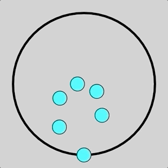

# First p5.js sketch

First attempt at creating an animation with p5js, I tried to recreate the below effect without reading any documentation on how it's done.  Got kinda close-ish I guess...

Update: I read some documentation on the original:

* What the original did (circular motion that looks linear): use a circle with diameter equal tot the radius of the larger circle.  Move the inner circle around the inside of the larger circle.  The eight equally spaced points around the inner circle happen to fall on the straight lines.
* What I did (linear motion that looks circular): create lines for small circles to move along and hope it lines up well to look like a circle.

Going to try and make a v2 following the original's outline.

### What I made:

  

### What I wanted to make:

  

